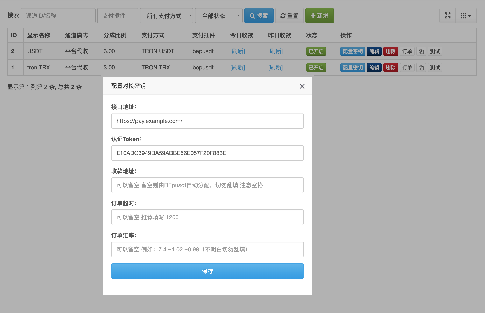

# 彩虹易支付 对接 BEpusdt

此款插件是基于 https://github.com/v03413/Epay 开发，理论原版彩虹易支付应该都可以使用。

使用之前默认你已经正常安装好了彩虹易支付和BEpusdt，这里不再赘述。

## 配置截图

## 使用教程

1. 点击[下载插件](https://github.com/v03413/Epay-BEpusdt/archive/refs/heads/main.zip)之后解压，
   把文件夹命名为`bepusdt`，然后放到彩虹易支付的网站根目录`plugins`目录下。
2. 彩虹易支付后台，`支付接口 -> 支付插件`，点击`刷新插件列表`；之后在插件名称列表里面如果发现`bepusdt`插件，
   说明安装成功。
3. 彩虹易支付后台，`支付接口 -> 支付方式`，点击`新增`；调用值填`bepusdt`，其它参数按需填写，保存启用。
4. 彩虹易支付后台，`支付接口 -> 支付通道`，点击`新增`；支付方式选择刚才新增的，支付插件选择`BEpusdt`，其它参数按需填写，确认保存。
5. 彩虹易支付后台，`支付接口 -> 支付通道`，找到刚才新增的通道点击`配置密钥`，按提示填写BEpusdt的相关参数，保存并启用，随后便可以开始测试。